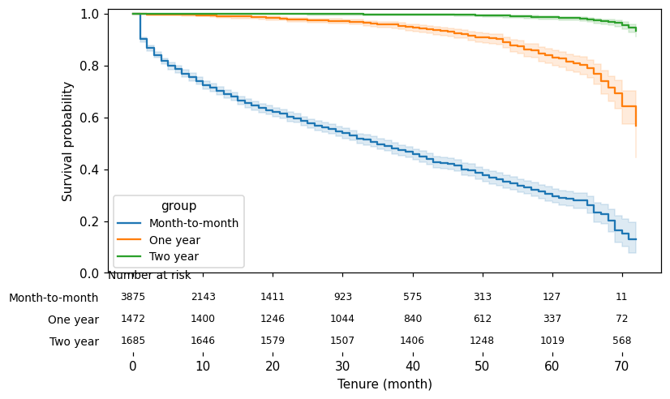

# Real data: the Telco churn dataset

<!-- requires-file: data/Telco-Customer-Churn.csv -->

The IBM Telco Customer Churn dataset (~7,000 customers) is the most-analyzed churn table in
existence -- and nearly every analysis of it makes the same two moves silently: it invents a
time axis, and it assumes the table contains every customer who ever signed up. Tenure makes
you perform both moves *out loud*. Along the way you get the classic results (contract type
dominates), done survival-correctly.

## 0. Get the data

Download `Telco-Customer-Churn.csv` from
[IBM's telco-customer-churn repository](https://github.com/IBM/telco-customer-churn-on-icp4d)
(Apache-2.0) or from Kaggle, and place it at `data/Telco-Customer-Churn.csv`. Tenure is
DataFrame-pure -- you own your I/O -- so nothing here fetches from the network.

## 1. The tenure-to-dates recipe

The dataset has no dates, just `tenure` in months and a `Churn` label -- a common warehouse
shape. Anchor everyone to a snapshot and reconstruct signup dates:

```python
import pandas as pd
import tenure

telco = pd.read_csv("data/Telco-Customer-Churn.csv")
telco = telco[telco["tenure"] > 0].copy()   # 11 rows with zero tenure: no observable time
SNAPSHOT = pd.Timestamp("2020-01-31")       # any anchor works; only durations matter
MONTH = 30.4375
telco["signup_date"] = SNAPSHOT - pd.to_timedelta(telco["tenure"] * MONTH, unit="D")
telco["exit_date"] = SNAPSHOT
```

Two explicit choices already: the famous 11 zero-tenure rows are dropped (they carry no
observable person-time -- try leaving them in with delayed entry modeled and Tenure will refuse
them for exactly that reason), and every exit lands on the snapshot, which is what the
dataset's "churned recently / still active now" labels actually describe.

## 2. The audit makes you answer the survivorship question

The `Churn` label is observed in a window around the snapshot. What about customers who signed
up in 2015 and churned in 2017? They are simply not in this table -- or are they? Declare the
observation window and let the audit ask:

```python
def build(**extra):
    return tenure.StudyDesign.from_status(
        telco,
        id_col="customerID",
        origin_col="signup_date",
        exit_col="exit_date",
        status_col="Churn",
        status_map={"Yes": "event", "No": "censored"},
        active_as_of=SNAPSHOT,
        analysis_start=SNAPSHOT - pd.Timedelta(days=MONTH),
        group_cols=["Contract"],
        covariate_cols=["MonthlyCharges"],
        time_unit="month",
        **extra,
    )

first = tenure.audit(build())
print([f"{r.check_id}:{r.status.name}" for r in first.results])
```

```text
['TNR001:WARN', 'TNR002:PASS', 'TNR003:PASS', 'TNR004:PASS']
```

TNR001 warns: thousands of signups predate the observation window, and if their early churns
are missing, every retention number is survivorship-inflated. Every Kaggle notebook answers
this question implicitly, by ignoring it. The standard reading of this dataset is that churned
customers' tenures are recorded (a complete historical cohort) -- so say so, explicitly:

```python
design = build(includes_pre_entry_churners=True)   # the standard -- and generous -- reading
report = tenure.audit(design)
print("audit clean:", report.clean)
```

```text
audit clean: True
```

The analysis is now on the record: *if* that attestation is wrong, the numbers below are upper
bounds. That single visible sentence is the difference between this walkthrough and the
thousand notebooks before it.

## 3. The classic result, survival-correctly

```python
km = tenure.KaplanMeier().fit(design, by="Contract")
print(tenure.retention_at(km, [12, 24]).round(3).to_string(index=False))
print(km.median_survival().round(1).to_string(index=False))
print(tenure.logrank_test(design, by="Contract").summary)
```

```text
         group  horizon  retention  ci_lower  ci_upper  supported
Month-to-month     12.0      0.703     0.687     0.718       True
Month-to-month     24.0      0.586     0.568     0.604       True
      One year     12.0      0.991     0.984     0.995       True
      One year     24.0      0.978     0.969     0.985       True
      Two year     12.0      1.000     1.000     1.000       True
      Two year     24.0      1.000     1.000     1.000       True
         group  median
Month-to-month    35.0
      One year     inf
      Two year     inf
log-rank: chi2=2352.873, df=2, p=0 -- groups differ at alpha=0.05
```

Month-to-month customers churn hard (median lifetime 35 months, 70% one-year retention);
contract customers barely churn at all, and the log-rank test confirms the separation is not
noise.

```python
ax = tenure.plot_survival(km, audit_report=report)
```



(The audit report rides along with the plot: had we bypassed a warning instead of resolving
it, the chart would carry a caveat stamp into whatever deck it lands in.)

## 4. Individual risk

A Cox model on monthly charges, and a scored customer list:

```python
cox = tenure.CoxPH().fit(design)
print(cox.fitter.summary[["coef", "exp(coef)", "p"]].round(4).to_string())

scores = tenure.churn_risk_scores(cox, horizon=12.0)
print(scores.table.sort_values("risk_score", ascending=False).head(5).round(3).to_string(index=False))
```

Each dollar of monthly charges multiplies the churn hazard by ~1.006 -- about 1.9x hazard
across the dataset's $100 spread of monthly charges.

## What this dataset cannot tell you

Worth stating, because Tenure's whole point is that assumptions decide the answer:

- **The label's window is ambiguous.** If `Churn = Yes` really means "churned in the *last
  month*" (a snapshot reading), then old churners are missing, `includes_pre_entry_churners=True`
  is false, and the correct design is delayed entry with each customer observed for only their
  final month. The dataset's documentation does not say. Two defensible readings, two different
  studies -- Tenure will run either, but never without you choosing one.
- **Contract type is the *current* contract.** A customer who upgraded month-to-month ->
  two-year is credited to the two-year curve for their whole life -- an immortal-time flavored
  caveat. With contract *history* this becomes a [time-varying design](../tutorials/time-varying.md);
  this table has no history to give.

## Where to go next

- [Scope](../scope.md) -- when Tenure fits your business (telecom does; a 90-day-inactivity
  rule does not).
- [Out-of-time validation](../tutorials/validation.md) -- what we could not do here: this
  dataset has no calendar axis to hold out.
