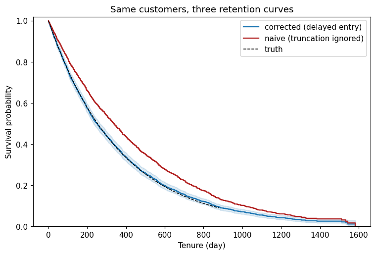

# The $10 mistake

A streaming service migrated its data warehouse on 2024-01-01. Churn events are only recorded
from that date -- anyone who churned earlier simply is not in the table. The analysts know the
migration happened; nothing about the *data* looks wrong. This walkthrough shows how that one
fact silently inflates LTV by ~11%, and how the audit stops it.

The data is synthetic with a known ground truth (exponential lifetimes, mean 365 days), so at
the end we can say exactly how wrong the naive number was.

## 1. The naive analysis runs without complaint

Nothing stops you from fitting a curve. That is the problem.

```python
import tenure

df = tenure.load_svod_demo(with_left_truncation=True)
naive = tenure.StudyDesign.from_event_dates(
    df,
    id_col="customer_id",
    origin_col="signup_date",
    churn_date_col="churn_date",
    active_as_of="2026-05-31",
    analysis_start="2024-01-01",   # the warehouse migration: records begin here
)
km_naive = tenure.KaplanMeier().fit(naive)
print(tenure.retention_at(km_naive, [365])[["retention", "ci_lower", "ci_upper"]].round(3))
```

```text
   retention  ci_lower  ci_upper
0      0.473     0.453     0.492
```

47% retention at one year. Tight confidence interval. Looks great in a deck. The true number
(we will see) is 36.8% -- the curve is inflated because every pre-2024 signup who churned
before the migration is missing, so the long-tenured customers in the table are, by
construction, survivors.

## 2. The audit asks the question you skipped

```python
report = tenure.audit(naive)
print(report.to_markdown())
```

TNR001 finds 781 customers whose signup predates the observation window and **warns**, asking
the one question that decides everything: *is your event history complete back to origin, or
not?*

```text
## [WARN] TNR001 -- Left-truncation / delayed entry

781 customers have origins before analysis_start (2024-01-01). If their pre-window
churns are unobserved, retention/LTV is biased upward.

Remediation: Confirm whether event history is complete back to origin (set
includes_pre_entry_churners), or model delayed entry via event_observed_from / entry_col.
```

## 3. Answer honestly, and the design cannot run

Churns before 2024 never made it into the warehouse. Say so, and the warning escalates to a
block -- the biased design is now unfittable:

```python
from tenure import AuditBlockedError

honest = tenure.StudyDesign.from_event_dates(
    df,
    id_col="customer_id",
    origin_col="signup_date",
    churn_date_col="churn_date",
    active_as_of="2026-05-31",
    analysis_start="2024-01-01",
    includes_pre_entry_churners=False,   # the truth: pre-migration churns are gone
)
try:
    tenure.audit(honest)
except AuditBlockedError as err:
    print(err)
```

```text
Study-design audit blocked (TNR001). Inspect the report (report.to_markdown()) and fix
the design, or rerun with strictness='warn' to proceed at your own risk.
```

## 4. The fix: delayed entry

`event_observed_from` tells Tenure when event recording began. Older customers now enter the
risk set at the tenure they were first observed -- not at tenure zero, where they could never
have been seen churning:

```python
corrected = tenure.StudyDesign.from_event_dates(
    df,
    id_col="customer_id",
    origin_col="signup_date",
    churn_date_col="churn_date",
    active_as_of="2026-05-31",
    analysis_start="2024-01-01",
    event_observed_from="2024-01-01",   # older customers enter the risk set late
)
report = tenure.audit(corrected)
print("audit:", "all clear" if report.clean else "findings remain")
km = tenure.KaplanMeier().fit(corrected)
```

```text
audit: all clear
```

## 5. Same customers, three curves

```python
import matplotlib.pyplot as plt
import numpy as np

truth = tenure.svod_demo_truth()
ax = tenure.plot_survival(km, at_risk=False)
ax.lines[0].set_label("corrected (delayed entry)")
naive_curve = km_naive.survival_.curve("overall")
ax.step(naive_curve.times, naive_curve.survival, where="post", color="firebrick",
        label="naive (truncation ignored)")
t = np.linspace(0.0, 880.0, 300)
ax.plot(t, np.exp(-t / truth.mean_lifetime_days), color="black", linestyle="--",
        linewidth=1.0, label="truth")
ax.legend()
ax.set_title("Same customers, three retention curves")
```



The corrected curve sits on top of the truth. The naive curve floats above both -- pure
survivorship, not better retention.

## 6. The dollar gap

At a $12/month contribution margin over a one-year horizon:

```python
ltv_naive = tenure.survival_weighted_ltv(km_naive, period_margin=12.0, horizon=365.0)
ltv_fixed = tenure.survival_weighted_ltv(km, period_margin=12.0, horizon=365.0)
print(f"naive LTV:     ${ltv_naive['ltv'].iloc[0]:.2f}")
print(f"corrected LTV: ${ltv_fixed['ltv'].iloc[0]:.2f}")
print(f"true LTV:      ${truth.ltv(monthly_margin=12.0, horizon_days=365.0):.2f}")
```

```text
naive LTV:     $101.16
corrected LTV: $90.81
true LTV:      $90.96
```

**$10.35 per customer** of over-statement -- from one unmodeled warehouse migration, with the
same estimator on the same rows. Multiply by a subscriber base and this is the difference
between a good quarter and a written-down acquisition model. The estimator was never wrong;
the *study design* was, and no estimator can see that. The audit can.

## Where to go next

- [Quickstart](../tutorials/quickstart.md) -- the same flow, condensed.
- [The bias audit](../audit-catalog.md) -- everything TNR001-TNR005 catch.
- [A 3-year LTV from 2 years of data](three-year-ltv.md) -- the opposite problem: horizons your
  data cannot reach.
