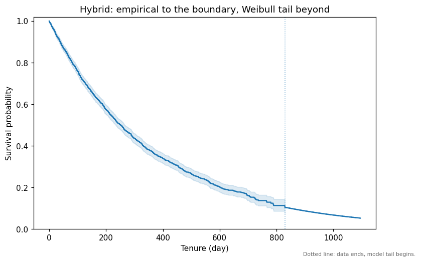

# A 3-year LTV from 2 years of data

Finance wants a 3-year LTV. Your subscription business has existed for about two years. A
Kaplan-Meier curve is *defined* by observed events, so it simply cannot answer -- and Tenure's
KM honestly refuses to pretend otherwise. This walkthrough shows the refusal, then the two
principled ways past it: a parametric fit, and a hybrid curve that stays empirical where you
have data and lets the model take over beyond.

Synthetic data again (exponential lifetimes, mean 365 days), so the punchline compares every
approach against the true 3-year number.

## 1. Kaplan-Meier tells you the truth: it cannot reach 3 years

```python
import tenure

df = tenure.load_svod_demo(with_left_truncation=False)
study = tenure.StudyDesign.from_event_dates(
    df,
    id_col="customer_id",
    origin_col="signup_date",
    churn_date_col="churn_date",
    active_as_of="2026-05-31",
)
tenure.audit(study)
km = tenure.KaplanMeier().fit(study)
print(tenure.rmst(km, horizon=1095).round(1).to_string(index=False))
```

```text
  group  requested_horizon  effective_horizon  rmst  truncated
overall             1095.0              829.3 331.0       True
```

`truncated=True`: the integral stopped at day 829, where the data's support ends. Tenure never
silently reads a flat tail out to day 1095 -- that would be extrapolation dressed up as
measurement.

## 2. A parametric model is defined at every tenure

Fit a Weibull and the curve exists everywhere. The fitted shape (~0.98, essentially 1.0)
correctly recovers that these synthetic lifetimes are memoryless:

```python
para = tenure.ParametricSurvival("weibull").fit(study)
print(para.params_.round(3).to_string(index=False))

hyb = tenure.hybrid_survival(km, para, horizon=1095)
print(tenure.rmst(hyb, horizon=1095).round(1).to_string(index=False))
```

```text
  group distribution parameter   value
overall      weibull     scale 370.133
overall      weibull     shape   0.982
  group  requested_horizon  effective_horizon  rmst  truncated
overall             1095.0             1095.0 350.9  False
```

The hybrid reaches the full horizon, `truncated=False`. Its construction: the empirical KM
curve up to the supported boundary, then the Weibull's *conditional* tail, rescaled so the two
meet exactly -- the data sets the level, the model contributes only the shape you cannot
observe.

## 3. The picture

```python
ax = tenure.plot_survival(hyb, at_risk=False)
ax.set_title("Hybrid: empirical to the boundary, Weibull tail beyond")
```



The dotted vertical line is the splice boundary -- committed to the chart itself, so nobody
downstream mistakes the projected tail for evidence.

## 4. Four answers to the 3-year question

At a $12/month margin:

```python
import pandas as pd

truth = tenure.svod_demo_truth()
rows = []
for name, model in [("KM (truncated)", km), ("parametric", para), ("hybrid", hyb)]:
    ltv = tenure.survival_weighted_ltv(model, period_margin=12.0, horizon=1095.0)
    rows.append({"model": name, "3yr LTV": round(float(ltv["ltv"].iloc[0]), 2),
                 "truncated": bool(ltv["truncated"].iloc[0])})
rows.append({"model": "truth", "3yr LTV": round(truth.ltv(12.0, 1095.0), 2), "truncated": False})
print(pd.DataFrame(rows).to_string(index=False))
```

```text
         model  3yr LTV  truncated
KM (truncated)   130.49       True
    parametric   138.72      False
        hybrid   138.35      False
         truth   136.74      False
```

The truncated KM understates the 3-year value by ~5% -- honestly flagged, but short. The
parametric and hybrid projections land within ~1.5% of the truth. The hybrid is the
recommended default: inside the data window it *is* the Kaplan-Meier estimate, confidence band
and all, so you give up nothing where evidence exists.

!!! warning "Projection is a model choice"
    These land near truth because the fitted Weibull matches the (synthetic) data-generating
    process. On real data, check the fit first -- compare the parametric curve against the KM
    inside the observed window -- and keep the splice boundary visible in everything you ship.

## Where to go next

- [Retention and LTV](../tutorials/retention-and-ltv.md) -- the business-output layer in depth.
- [The $10 mistake](the-ltv-gap.md) -- the opposite failure: data that lies about the window
  you *do* have.
